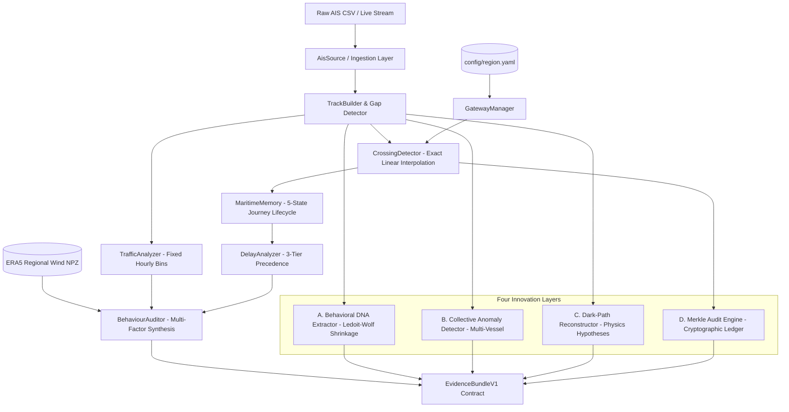
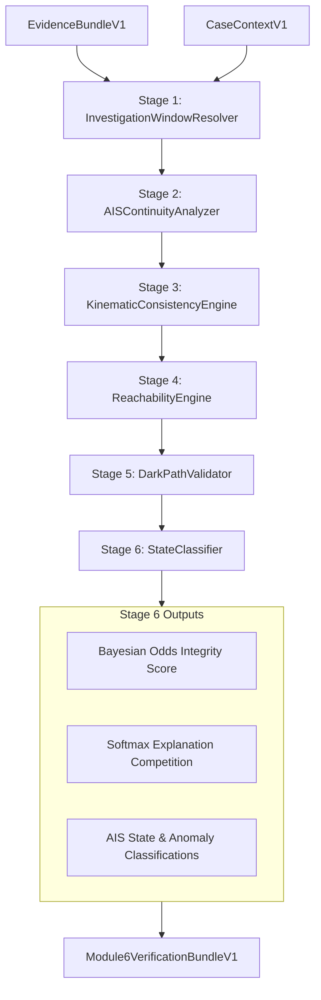

# Occuris — Oil Spill Causal Attribution System

**Problem Statement 26143 — Smart India Hackathon 2026 (NTRO)**

Occuris is an intelligence-grade, forensically honest maritime causal attribution platform designed to track, explain, and attribute maritime events such as oil spills without premature accusation or bias.

---

## Module 5: Maritime Memory & Virtual Gateways Engine

Module 5 reconstructs and audits all vessel movements through monitored maritime corridors (e.g., the Arabian Sea economic zone). It provides objective answers to:
> *"Which vessels entered the monitored maritime region, where did they go, how long did they take, and was their movement normal or unexplained?"*

Module 5 operates with **zero guilt language**, never outputs accusations or culprit labels, and focuses strictly on empirical evidence, physical constraints, and verifiable provenance.

### Core Architecture



---

### Key Capabilities & Innovation Layers

1. **Virtual Corridor Gateways & Exact Sub-Second Crossing**:
   - Monitored corridors defined strictly via `config/region.yaml`.
   - Exact linear time interpolation: $t_{cross} = t_1 + r(t_2 - t_1)$ with bounded $r \in [0.0, 1.0]$.
   - Idempotent suppression of duplicate pings and boundary noise.

2. **Maritime Memory (5-State Journey Tracking)**:
   - Tracks vessels through five mutually exclusive states: `COMPLETED`, `IN_REGION`, `ENTRY_ONLY_PARTIAL`, `EXIT_ONLY_PARTIAL`, and `WINDOW_INTERIOR`.

3. **Multi-Factor Delay Explanation**:
   - 3-tier expected duration precedence: (1) Historical profile ($\ge 5$ transits), (2) Corridor baseline speed (IMO commercial standard), (3) Insufficient history.
   - Objective explanations: Corridor traffic congestion ($\ge 75$th percentile), adverse ERA5 wind conditions, legitimate navigational status (at anchor, moored, restricted maneuverability).

4. **Innovation Layer A — Behavioral DNA Kinematic Signatures**:
   - Extracts 8 kinematic features (speed, acceleration, turn-rate moments, loiter ratio, path straightness).
   - Computes symmetric regularized Mahalanobis re-identification distances across blackout boundaries using Ledoit-Wolf covariance shrinkage.

5. **Innovation Layer B — Collective Fleet Anomaly Detection**:
   - Rule R1: Coordinated dark vessels (temporal overlap & spatial proximity).
   - Rule R2: Rendezvous at sea (proximity $< 500\text{ m}$ for $\ge 20\text{ min}$ at low speed).
   - Rule R3: Trajectory convergence & parallel steaming.

6. **Innovation Layer C — Physics-Informed Dark-Path Reconstruction**:
   - Reconstructs unobserved trajectories during AIS coverage gaps across 4 physical hypotheses: Geodesic, Rhumb line, DNA-prior, and CMEMS Ocean Current-assisted advection.
   - Evaluates kinematic feasibility against maximum vessel capabilities and computes normalized softmax cost probabilities.

7. **Innovation Layer D — Tamper-Evident Merkle Audit Ledger**:
   - Hash-chains all crossing events from genesis (`0`*64) forward.
   - Periodically anchors Merkle roots and SHA-256 dataset provenance hashes (`input_csv_hash`, `region_yaml_hash`, `pipeline_params_hash`) into SQLite `run_manifests`.
   - Instantly detects any historical database tampering or out-of-order mutations.

---

### Verification & Testing

Module 5 includes 58 automated tests across unit, integration, property, contract, and architectural integrity suites.

```bash
# Run complete test suite with coverage report
pytest tests/ --cov=src/ais --cov-fail-under=85

# Run individual verification suites
pytest tests/contract/ -v      # Frozen EvidenceBundleV1 schema verification
pytest tests/property/ -v      # Mathematical and invariance properties
pytest tests/integrity/ -v     # Zero-guilt language & import boundaries
pytest tests/integration/ -v   # Full pipeline integration with ground truth
```

### Forensic Evidence Bundle API

```http
GET /api/v1/maritime/evidence-bundle/{vessel_id}?case_id=CASE-2026-001
```

Exports the frozen `EvidenceBundleV1` structure consumed by downstream analytical modules:
- Complete vessel journey milestones
- Detected AIS coverage blackouts
- Empirically grounded delay analysis
- Objective multi-factor behavioral assessment
- Kinematic Behavioral DNA match scores
- Multi-vessel collective anomaly associations
- Physics-informed candidate dark paths
- Cryptographic Merkle provenance root and row hashes

---

## Module 6: AIS Verification Engine

Module 6 conducts an empirical, six-stage forensic verification of vessel AIS records during the spill investigation window. Built on frozen Module 5 `EvidenceBundleV1` outputs and `CaseContextV1`, it determines tracking filter consistency, reachability boundaries, and honest evidential classifications.

### Six-Stage Verification Pipeline



### Key Stages & Capabilities

1. **Stage 1 — Investigation Window Resolver**: Computes the temporal and spatial intersection between the release window (with configurable padding) and the vessel's journey.
2. **Stage 2 — AIS Continuity Analyzer**: Computes the regional gap concurrency index against other nearby vessels to distinguish regional infrastructure outages from solo blackouts.
3. **Stage 3 — Kinematic Consistency Engine**: Constant-Velocity Extended Kalman Filter (CV-EKF in local ENU). Evaluates Normalized Innovation Squared (NIS) against $\chi^2(2)$ and flags teleport jumps, impossible speeds, and simultaneous identity conflicts (>50 km within 30 min).
4. **Stage 4 — Physical Reachability Engine**: Evaluates whether reported positions and candidate round-trips to the probable spill origin zone are physically reachable under vessel class speed limits assisted by CMEMS ocean currents.
5. **Stage 5 — Dark-Path Hypothesis Validator**: Validates kinematic plausibility and probability mass intersecting the origin zone for unobserved blackout intervals, preserving the mandatory hypothesis disclaimer.
6. **Stage 6 — State Classifier & Evidential Aggregator**: Executes evidential competition across `{COVERAGE, WEATHER, TRAFFIC, OPERATIONAL, CONCEALMENT_PATTERN}` using softmax, computes Bayesian odds-form posterior track integrity ($P(\text{reliable} \mid \text{evidence})$) with sensitivity intervals, and emits `NORMAL`, `AIS_GAP_DARK`, `REPORTING_ANOMALY`, or `AMBIGUOUS`.

### Verification API Endpoints

```http
POST /api/v1/verification/run/{vessel_id}?case_id=case_01
GET  /api/v1/verification/report/{vessel_id}?case_id=case_01
GET  /api/v1/verification/case/{case_id}
GET  /api/v1/verification/ledger/verify
POST /api/v1/verification/analyst-labels
GET  /api/v1/verification/review-queue
```
