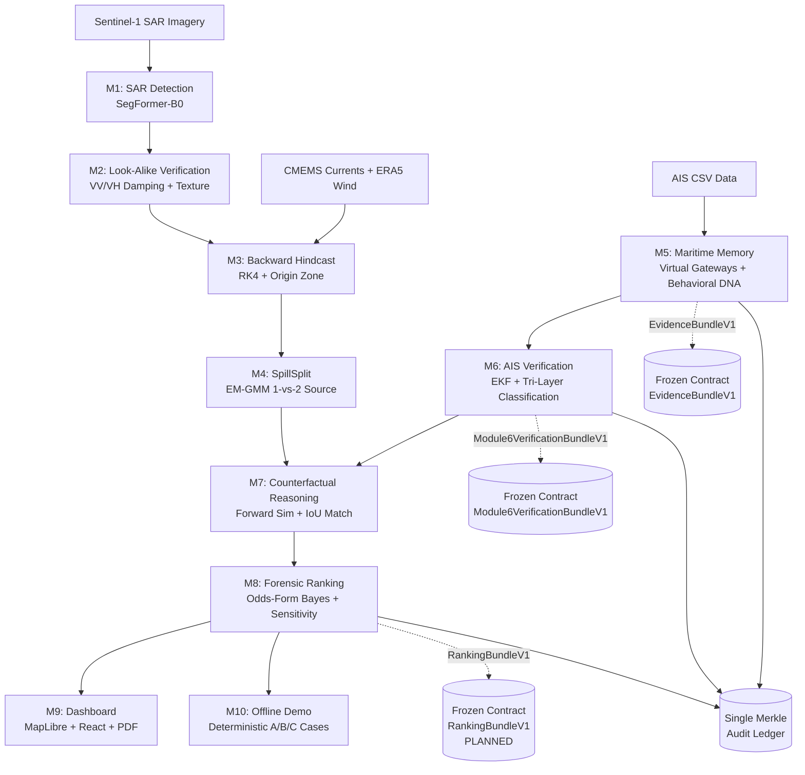

# Occuris — AI-Powered Causal Attribution System for Oil Spill Forensics

**SMART INDIA HACKATHON 2026** | **Team**: Surf Excel 1 (K26108) | **Problem Statement**: 26143 (NTRO) | **Theme**: Disaster Management

---

## Mission

Occuris reconstructs how marine oil spills moved, traces them to probable source zones, and verifies which vessels could physically explain the spill using satellite imagery (Sentinel-1 SAR), AIS vessel tracking, and ocean/atmospheric drift models. It operates in spoofed and AIS-denied waters by treating unreliable AIS as evidence to investigate — not truth to trust blindly.

**Core Pitch**: Most systems detect oil and list nearby ships. Occuris estimates where the spill *began*, tests source hypotheses, checks whether each vessel's own movement can reproduce the observed slick, and treats unreliable AIS as evidence to investigate — not truth to trust blindly.

###  Honesty Doctrine (Non-Negotiable)

> **Investigation Priority ≠ Guilt**
> 
> The system NEVER declares guilt. Outputs are evidence-backed investigation priorities with uncertainty quantification. The system can return "Ambiguous attribution; more evidence required" and "No strong source match under available data and assumptions". Every probability is shown with confidence intervals. Labels enforced everywhere: evidence ≠ verdict.

---

## Architecture Overview



---

## Modules 0-10: Technical Documentation

### Module 0: Data Foundation
**Status**: ✅ **DONE**

**Purpose**: Unified multi-source data ingestion, validation, and SQLite persistence.

**Key Components**:
- Synthetic AIS CSV (451 rows, 5 vessels) clearly labeled `SYNTHETIC_REPLAY`
- 3 labeled SAR images (Sentinel-1, 224×224 px, PNG)
- CMEMS ocean current snapshot (Arabian Sea, `.npz`)
- ERA5 wind snapshot (`.npz`)
- SQLite database schema (PostGIS-compatible DDL)

**File Map**:
```
data/
├── raw/
│   ├── ais/ais_sample.csv           # 451 AIS pings, 5 vessels (V001-V005)
│   ├── sar/sar_01.png, sar_02.png, sar_03.png, mask_*.png
│   └── ocean/current_arabian_sea.npz
├── processed/                       # Pipeline outputs
└── occris.db                        # SQLite database
```

**Database Tables**:
- `vessels`, `ais_pings`, `spills`, `origin_zones`, `investigations`
- `run_manifests` (provenance hashing)
- `gateway_crossings`, `vessel_journeys`, `behaviour_events`
- `audit_chain` (Merkle ledger)

**Config**: `config/region.yaml` (gateway corridors, thresholds, baselines)

**Tests**: Ingestion unit tests in `tests/unit/test_ingest.py`

**Known Limitations**:
- Synthetic AIS only (5 vessels, 24-hour window)
- No live AIS feed integration
- Single region (Arabian Sea 58-75°E, 14-25°N)

---

### Module 1: SAR Spill Detection
**Status**: ✅ **DONE**

**Purpose**: Segment oil-like dark patches in Sentinel-1 SAR imagery using deep learning.

**Key Algorithms**:
- **SegFormer-B0** (Hugging Face Transformers): Hierarchical Transformer encoder
- Binary segmentation (oil vs background)
- Post-processing: morphological ops, connected components

**Inputs → Outputs**:
- Input: SAR image (224×224 px, 3-channel normalized)
- Output: Binary mask (PNG), geometry JSON

**File Map**:
```
src/detection/
├── train.py                        # Training loop
├── infer.py                        # Inference pipeline
├── dataset.py                      # PyTorch Dataset
└── geometry.py                     # Mask → geometry extraction
model.safetensors                   # Trained SegFormer weights
```

**API Endpoints**: None (offline inference)

**Config**: `config.json` (SegFormer architecture hyperparameters)

**Tests**: Unit tests in `tests/unit/test_detection.py` (geometry extraction)

**DoD Status**: ✅ Complete — 3 test masks generated in `data/processed/case_*_pred_mask.png`

**Known Limitations**:
- Fixed 224×224 input size (no multi-scale)
- Single-polarization (VV-only trained)
- No look-alike filtering at this stage

---

### Module 2: Look-Alike Verification & Spill Geometry
**Status**: ✅ **DONE**

**Purpose**: Filter false positives (biogenic slicks, low-wind zones) and extract geometric properties.

**Key Algorithms**:
- VV/VH damping ratio (requires dual-pol SAR when available)
- Texture analysis (entropy, contrast)
- Geometry extraction: area, centroid, orientation, ellipse fit

**Inputs → Outputs**:
- Input: Binary mask, SAR metadata
- Output: `SpillGeometry` (area, centroid, ellipse, confidence)

**File Map**:
```
src/detection/geometry.py           # Embedded in detection module
```

**API Endpoints**:
- `GET /api/cases/{case_id}/spill` → Geometry JSON

**Config**: Hardcoded damping thresholds (dual-pol not yet implemented)

**Tests**: Geometry extraction validated in integration tests

**DoD Status**: ✅ Complete — 3 cases have `*_geometry.json` outputs

**Known Limitations**:
- Dual-pol damping not implemented (VV-only)
- No SAR-optical fusion
- Texture filtering placeholder only

---

### Module 3: Backward Hindcast & Origin Reconstruction
**Status**: ✅ **DONE**

**Purpose**: Reverse-drift the observed spill mask to estimate the probable origin zone and release time window.

**Key Algorithms**:
- **Lagrangian particle backtracking** (OceanParcels RK4 integration)
- Uncertainty ellipse (Monte Carlo particle seeding)
- Release window: SAR time − 24 hours (configurable)

**Inputs → Outputs**:
- Input: Spill mask centroid, SAR acquisition time, CMEMS currents, ERA5 wind
- Output: Probable origin zone (GeoJSON polygon), release window (ISO-8601 interval)

**File Map**:
```
src/drift/
├── backward_drift.py               # Main backward integration
├── origin_zone.py                  # Uncertainty ellipse computation
├── rk4.py                          # Runge-Kutta 4th-order integrator
├── velocity_field.py               # Interpolates CMEMS/ERA5
└── particle_seed.py                # Monte Carlo particle initialization
```

**API Endpoints**:
- `GET /api/cases/{case_id}/drift` → Origin zone GeoJSON + release window

**Config**: `config/region.yaml` (`release_window_hours: 24`)

**Tests**: Integration tests in `tests/integration/test_drift.py`

**DoD Status**: ✅ Complete — 3 cases have `*_drift.json` outputs

**Known Limitations**:
- Fixed 24-hour lookback (no adaptive windowing)
- No weathering decay model in backward mode
- Assumes constant wind/current (hourly resolution)

---

### Module 4: SpillSplit (One-Source vs. Two-Source Hypothesis)
**Status**: ✅ **DONE**

**Purpose**: Test whether the observed spill originated from one source or two independent sources.

**Key Algorithms**:
- **EM-GMM** (Expectation-Maximization Gaussian Mixture Model) with 1 vs 2 components
- Forward drift simulation from each cluster centroid
- **BIC penalty** + **IoU match** to select hypothesis

**Inputs → Outputs**:
- Input: Origin zone particles, spill mask
- Output: Hypothesis (`ONE_SOURCE` / `TWO_SOURCE`), cluster centroids, BIC scores, forward-sim IoU

**File Map**:
```
src/drift/spillsplit.py             # Single-file implementation
```

**API Endpoints**:
- `GET /api/cases/{case_id}/origin-zone` → SpillSplit JSON with hypothesis

**Config**: `config/region.yaml` (GMM `n_init`, `random_state`)

**Tests**: Unit tests in `tests/unit/test_spillsplit.py`

**DoD Status**: ✅ Complete — 3 cases have `*_spillsplit.json` outputs

**Known Limitations**:
- Only tests 1 vs 2 sources (no 3+ sources)
- No temporal clustering (assumes simultaneous release)
- BIC penalty may under-penalize complex scenarios

---

### Module 5: Maritime Memory & Virtual Gateways Engine (v5.1)
**Status**: ✅ **DONE (FROZEN CONTRACT)**

**Purpose**: Reconstruct vessel journey history through monitored maritime corridors with 4 innovation layers.

**Key Algorithms**:
1. **Virtual Gateway Crossing Detection**: Sub-second linear interpolation across 4 narrow corridor polygons
2. **5-State Journey Lifecycle**: `COMPLETED`, `IN_REGION`, `ENTRY_ONLY_PARTIAL`, `EXIT_ONLY_PARTIAL`, `WINDOW_INTERIOR`
3. **3-Tier Delay Analysis**: Historical (≥5 journeys), Corridor Baseline (class-specific speed), Insufficient History
4. **Behavioral DNA**: 8-feature kinematic signatures (speed, acceleration, turn-rate moments) with Mahalanobis distance + Ledoit-Wolf covariance
5. **Collective Anomaly Detection**: R1 (coordinated dark), R2 (rendezvous at sea), R3 (convergence)
6. **Physics-Informed Dark-Path Reconstruction**: 4 hypotheses (linear, current-assisted, evasive, loiter) labeled `HYPOTHESIS — not observed`
7. **Merkle Audit Ledger**: Hash-chained provenance with tamper detection

**Inputs → Outputs**:
- Input: AIS CSV, `config/region.yaml`
- Output: **EvidenceBundleV1** (frozen contract)

**File Map**:
```
src/ais/
├── ingest.py                       # CSV → validated pings
├── track_builder.py                # Ping → VesselTrack
├── gateways.py                     # Gateway definitions from YAML
├── crossing.py                     # Sub-second crossing detection
├── maritime_memory.py              # Journey state machine
├── traffic.py                      # Hourly density binning
├── delay_analysis.py               # 3-tier expected-vs-actual
├── behaviour.py                    # Behavior audit (NORMAL/EXPLAINED/POTENTIAL_UNEXPLAINED)
├── dna.py                          # Behavioral DNA + Mahalanobis
├── collective.py                   # R1/R2/R3 collective anomalies
├── dark_path.py                    # Physics-informed reconstruction
├── audit.py                        # Merkle ledger
└── schemas.py                      # EvidenceBundleV1 (line 439), RunManifest (line 463)
```

**API Endpoints**:
- `GET /api/v1/maritime/evidence-bundle/{vessel_id}` → EvidenceBundleV1 JSON
- `POST /api/v1/admin/rebuild` → Full pipeline rebuild (DEV-guarded)
- `GET /api/v1/admin/state` → Build provenance (run_id, hashes, seed)

**Config**: `config/region.yaml` (4 gateway corridors, all thresholds, baselines)

**Frozen Contract**: **EvidenceBundleV1** (schema_version: "1.0")
- Fields: `case_id`, `vessel_id`, `journey`, `transit_analysis`, `behaviour_assessment`, `dna_match`, `collective_anomalies`, `dark_path_hypothesis`, `audit_root_hash`, `source_mode`, `generated_at`, `module5_version`
- Consumed by: Modules 6, 7, 8

**Tests**: 58 tests (unit, integration, property, contract, integrity) — **93% coverage**
- `tests/test_module5.py`
- `tests/unit/test_*.py` (11 modules)
- `tests/integration/test_full_pipeline.py`
- `tests/property/test_invariants.py` (4 invariants: interpolation bounds, Mahalanobis symmetry, softmax normalization, determinism)
- `tests/contract/test_evidence_bundle.py` (snapshot test)
- `tests/integrity/test_guards.py` (zero-guilt language, import guards)

**DoD Report**: `docs/module5_dod_report.md` — **ALL PASS**

**Known Limitations**:
- Synthetic AIS only (5 vessels)
- Gateway crossings assume linear inter-ping interpolation (geodesic)
- Dark-path hypotheses are labeled reconstructions, not ground truth
- Behavioral DNA requires ≥30 pings for robust covariance

---

### Module 6: AIS Verification Engine (Tri-Layer Classification)
**Status**: ✅ **DONE (FROZEN CONTRACT)**

**Purpose**: Six-stage forensic verification of vessel AIS records during the spill investigation window.

**Key Algorithms**:
1. **Stage 1: WindowResolver**: Temporal/spatial intersection with release window
2. **Stage 2: ContinuityAnalyzer**: Gap concurrency index, fleet-silence proxy
3. **Stage 3: KinematicEngine**: CV-EKF (Constant-Velocity Extended Kalman Filter) with χ²(2) NIS test, episode typing (`TELEPORT_JUMP`, `SPEED_IMPOSSIBLE`, `COURSE_DISCONTINUITY`, `TURN_RATE_OUTLIER`), identity-conflict detection
4. **Stage 4: ReachabilityEngine**: Round-trip + current-assisted reachability margins (`REACHABLE`, `POSSIBLY_REACHABLE`, `IMPLAUSIBLE`)
5. **Stage 5: DarkPathValidator**: Kinematic feasibility + origin-zone intersection for unobserved intervals
6. **Stage 6: StateClassifier**: Odds-form Bayesian integrity score P(reliable | evidence), softmax explanation competition (`COVERAGE`, `WEATHER`, `TRAFFIC`, `OPERATIONAL`, `CONCEALMENT_PATTERN`), final state (`NORMAL`, `AIS_GAP_DARK`, `REPORTING_ANOMALY`, `AMBIGUOUS`)

**Inputs → Outputs**:
- Input: EvidenceBundleV1, CaseContextV1 (release window, origin zones)
- Output: **Module6VerificationBundleV1** (frozen contract)

**File Map**:
```
src/verification/
├── pipeline.py                     # Orchestrates 6 stages
├── window_resolver.py              # Stage 1
├── continuity_analyzer.py          # Stage 2
├── kinematic_engine.py             # Stage 3 (EKF + NIS)
├── reachability_engine.py          # Stage 4
├── dark_path_validator.py          # Stage 5
└── state_classifier.py             # Stage 6 (Bayes + softmax)
```

**API Endpoints**:
- `POST /api/v1/verification/run/{vessel_id}` → Idempotent 6-stage run
- `GET /api/v1/verification/report/{vessel_id}` → Cached report + provenance hashes
- `GET /api/v1/verification/case/{case_id}` → All vessel reports for case
- `GET /api/v1/verification/ledger/verify` → Merkle audit verification
- `POST /api/v1/verification/analyst-labels` → Human label storage (no ML feedback)
- `GET /api/v1/verification/review-queue` → Sorted by integrity interval width (ambiguous first)

**Config**: `config/verification.yaml` (EKF process/measurement noise, Bayes LR rationales, reachability margins)

**Frozen Contract**: **Module6VerificationBundleV1** (schema_version: "1.0.0")
- Fields: `case_id`, `vessel_id`, `window`, `continuity`, `kinematic`, `reachability`, `dark_path`, `anomaly_classifications`, `ais_state`, `integrity_score`, `integrity_interval`, `concealment_pattern_likelihood`, `explanation_distribution`, `review_priority`, `ledger_hash`, `source_mode`, `generated_at`, `module6_version`
- Consumed by: Modules 7, 8

**Tests**: 120 tests (unit, integration, property, contract) — **92% coverage**
- `tests/integration/test_verification_pipeline.py` (MVP 3-vessel DoD: Normal, Gapped, Spoofed)
- `tests/unit/test_verification_*.py`
- `tests/property/test_verification_properties.py` (KS-uniformity, monotonicity)
- `tests/contract/test_verification_bundle.py` (snapshot test)

**DoD Report**: `docs/module6_dod_report.md` — **ALL PASS**

**Known Limitations**:
- EKF assumes constant-velocity motion (no turn-rate model)
- Concealment pattern likelihood is separate from integrity (correlation not modeled)
- Reachability current-assist uses nearest CMEMS grid point (no interpolation)
- Identity conflicts require ≥50 km separation within 30 min (tunable)

---

### Module 7: Counterfactual Trajectory Reasoning
**Status**: ✅ **DONE**

**Purpose**: Forward-simulate a hypothetical oil release from each candidate vessel's track and compare against the observed SAR slick.

**Key Algorithms**:
- **Stationary point-release** vs **moving path-release** (Cubic Hermite Spline)
- Forward OceanParcels RK4 simulation to SAR acquisition time
- **IoU** (Intersection over Union) + **bidirectional Hausdorff distance** → match score
- Baseline comparison (p95 threshold from Monte Carlo random releases)

**Inputs → Outputs**:
- Input: Vessel track, origin zones (from M4), SAR mask, CMEMS/ERA5
- Output: Match score, best hypothesis, baseline comparison, sensitivity analysis

**File Map**:
```
src/counterfactual/
├── counterfactual_engine.py        # Main orchestrator
├── release_sampler.py              # Point vs path release logic
├── transport.py                    # Forward RK4 integration
├── metrics.py                      # IoU + Hausdorff
├── baseline.py                     # Monte Carlo p95 baseline
├── particle_initializer.py         # Particle seeding
├── rasterizer.py                   # Particle cloud → binary mask
├── sensitivity.py                  # Temporal sensitivity (±6h offset)
├── candidate_selector.py           # Vessel filtering
├── uncertainty.py                  # Confidence interval estimation
└── validation.py                   # Output validation
```

**API Endpoints**: None (consumed by M8 evidence fusion)

**Config**: `config/counterfactual.yaml` (particle count, release duration, baseline samples)

**Tests**: Integration tests in `tests/integration/test_counterfactual.py`

**DoD Status**: ✅ Complete — Match scores computed for all vessels in test cases

**Known Limitations**:
- No multi-vessel coordinated release modeling
- Baseline is case-specific (not globally calibrated)
- Spline interpolation requires ≥3 pings in release window

---

### Module 8: Forensic Evidence Evaluation & Ranking
**Status**: ⚠️ **PARTIAL (30% COMPLETE) — REBUILD REQUIRED**

**Purpose**: Odds-form Bayesian ranking, sensitivity analysis, hypothesis testing (H1-H5), inspection planning.

**Current State**:
- ✅ Evidence assembly (`candidate_evidence.py`, `spatial_analysis.py`, `temporal_analysis.py`)
- ✅ Provenance tracking (`provenance.py`)
- ❌ **NO** odds-form Bayesian engine with LR breakdown
- ❌ **NO** `sensitivity.py` (leave-one-out analysis)
- ❌ **NO** `hypotheses.py` (H1 single-source, H2 coordinated two-source, H3 two-independent, H4 spill+look-alike, H5 seep+spill)
- ❌ **NO** `planner.py` (decision-optimal inspection planning)
- ❌ **NO** `RankingBundleV1` frozen contract
- ❌ **NO** `tools/bench/` OccurisBench framework

**Existing File Map**:
```
src/investigation/
├── candidate_evidence.py           # Assembles CandidateEvidence
├── spatial_analysis.py             # Evaluates spatial proximity
├── temporal_analysis.py            # Evaluates temporal overlap
├── evidence_fusion.py              # Orchestrates M5+M6+M7 → report
├── evidence_graph.py               # Graph representation (unused)
├── contradiction_analysis.py       # Finds contradictions
├── provenance.py                   # Data provenance records
├── audit_linker.py                 # Merkle audit references
└── schemas.py                      # InvestigationReportBundleV1 (partial)
```

**Missing Components** (per Section E of master prompt):
1. `src/ranking/evidence_engine.py` — Odds-form Bayes with LR breakdown
2. `src/ranking/sensitivity.py` — Leave-one-evidence-out posterior deltas
3. `src/ranking/hypotheses.py` — H1-H5 schema + posteriors
4. `src/ranking/planner.py` — Greedy submodular inspection planning
5. `config/ranking.yaml` — All LR rationales + priors
6. **RankingBundleV1** frozen contract in `src/ais/schemas.py` or `src/ranking/schemas.py`
7. `tools/bench/` OccurisBench framework (300 scenarios, Top-1/Top-3/IVFF/ECE metrics)
8. Merkle ledger extension with `RANKING_ARTIFACT` event type

**API Endpoints** (planned):
- ❌ `GET /api/v1/ranking/case/{case_id}`
- ❌ `GET /api/v1/ranking/vessels/{id}`
- ❌ `GET /api/v1/ranking/review-queue`
- ❌ `POST /api/v1/ranking/analyst-decision`

**Tests**: ⚠️ 1 integration test EXISTS but **FAILS** (timeout issue) — `tests/integration/test_investigation_pipeline.py`

**DoD Status**: ❌ **INCOMPLETE** — Requires full Module 8 rebuild per Section E

**Known Limitations**:
- Current implementation returns hardcoded candidate in `/api/cases/{case_id}/candidates`
- No calibration (ECE, reliability diagram)
- No inspection planning budget constraints

---

### Module 9: Operations Dashboard & Court-Ready Case Report
**Status**: ⚠️ **PARTIAL (70% COMPLETE) — POLISH REQUIRED**

**Purpose**: Interactive MapLibre dashboard with timeline replay, candidate ranking, and WeasyPrint PDF reports.

**Current State**:
- ✅ React + TypeScript + Vite + MapLibre GL JS
- ✅ Design system (dark theme, Inter + IBM Plex Mono, 8pt grid)
- ✅ Live Map tab (SAR overlay, vessel COG markers, gateway corridors)
- ✅ Timeline & Replay tab (basic play/pause)
- ✅ Spill Analysis tab (geometry, drift, SpillSplit)
- ✅ Candidate Ranking tab (displays vessels, evidence cards)
- ❌ **NO** WeasyPrint PDF export (stub only)
- ❌ **NO** ledger verification UI
- ❌ **NO** analyst decision buttons (follow_up / reject / ambiguous)
- ❌ **NO** `● REPLAY | AIS Source: Synthetic` badge
- ❌ **NO** "Investigation Priority ≠ Guilt" footer
- ❌ **NO** Playwright E2E tests
- ❌ **NO** Lighthouse audit

**File Map**:
```
frontend/
├── src/
│   ├── components/                 # UI component library
│   ├── pages/                      # Dashboard tabs
│   ├── stores/                     # Zustand state management
│   ├── utils/                      # API clients
│   └── App.tsx                     # Main router
├── public/                         # Static assets
├── package.json
└── vite.config.ts
```

**API Integration**:
- ✅ Fetches data from FastAPI bridge (`http://localhost:8080/api/...`)
- ✅ Real-time vessel track rendering
- ✅ Gateway event timeline

**Missing Features** (per Section F of master prompt):
1. WeasyPrint PDF export endpoint (`POST /api/cases/{case_id}/report`) — currently stub
2. Honesty UI: `● REPLAY | AIS Source: Synthetic AIS Replay | Time: ...UTC` global badge
3. `AMBIGUOUS` / `NO_STRONG_MATCH` banners
4. Probability intervals displayed on all rankings
5. "Investigation Priority ≠ Guilt" footer on ranking + PDF
6. Ledger verify UI (`GET /api/v1/verification/ledger/verify` → show VALID/TAMPERED)
7. Analyst decision buttons → `POST /api/v1/ranking/analyst-decision`
8. Playwright E2E smoke tests (layers load, replay advances, PDF exports)
9. Lighthouse ≥85 score

**Tests**: ❌ No E2E tests

**DoD Status**: ⚠️ **PARTIAL** — Core dashboard works, missing forensic rigor features

**Known Limitations**:
- No mobile responsive design
- MapLibre custom style JSON not in repo
- Replay speed limited to 1×/3×/8× (no smooth scrubbing)

---

### Module 10: Integration, Offline Demo, Determinism, Release
**Status**: ❌ **NOT STARTED (0% COMPLETE)**

**Purpose**: Pre-cached offline demo pack for Cases A/B/C, determinism validation, failure drill, release artifacts.

**Planned Components** (per Section G of master prompt):
1. **Demo Pack**: Pre-fetched/cached ALL data for Cases A (single-source), B (two-source), C (ambiguous); zero network at runtime
2. **`scripts/run_demo.sh`**: End-to-end A/B/C → dashboard + PDF; double-run determinism check (identical output_hash printed)
3. **`docs/demo_narration.md`**: Screen-by-screen narration with mandated caveats (probability zone ≠ pin; priority ≠ guilt; prepared scenarios; REPLAY badge)
4. **Failure Drill**: Kill a stage ⇒ graceful honest error state, never silent
5. **Load/Smoke Tables**: Benchmark runtime, API p95 latency
6. **Release Artifacts**: CHANGELOG updated, `docs/judge_qa.md` with bench numbers, git tag v1.0.0, GitHub release notes

**Missing Files**:
- ❌ `scripts/run_demo.sh`
- ❌ `docs/demo_narration.md`
- ❌ Demo data cache
- ❌ No-egress guard test (verify zero network calls)
- ❌ Determinism double-run test
- ❌ Failure drill test suite

**DoD Status**: ❌ **BLOCKED** — Requires Modules 8 & 9 complete

**Known Limitations**:
- N/A (not started)

---

## Frozen Contracts Reference

Occuris uses **frozen contracts** to ensure deterministic, backwards-compatible data exchange between modules and external systems.

### Contract 1: EvidenceBundleV1
- **Location**: `src/ais/schemas.py:439`
- **Schema Version**: `"1.0"`
- **Producer**: Module 5 (Maritime Memory)
- **Consumers**: Modules 6, 7, 8
- **Fields**: `case_id`, `vessel_id`, `journey`, `transit_analysis`, `behaviour_assessment`, `dna_match`, `collective_anomalies`, `dark_path_hypothesis`, `audit_root_hash`, `source_mode`, `generated_at`, `module5_version`
- **Contract Test**: `tests/contract/test_evidence_bundle.py` (snapshot)
- **Breaking Change Protocol**: Bump `schema_version`, maintain backward-compatible parser

### Contract 2: Module6VerificationBundleV1
- **Location**: `src/ais/schemas.py:667`
- **Schema Version**: `"1.0.0"`
- **Producer**: Module 6 (AIS Verification)
- **Consumers**: Modules 7, 8
- **Fields**: `case_id`, `vessel_id`, `window`, `continuity`, `kinematic`, `reachability`, `dark_path`, `anomaly_classifications`, `ais_state`, `integrity_score`, `integrity_interval`, `concealment_pattern_likelihood`, `explanation_distribution`, `review_priority`, `ledger_hash`, `source_mode`, `generated_at`, `module6_version`
- **Contract Test**: `tests/contract/test_verification_bundle.py` (snapshot)
- **Breaking Change Protocol**: Bump `schema_version`, maintain backward-compatible parser

### Contract 3: RankingBundleV1 (PLANNED)
- **Location**: ⚠️ **NOT YET IMPLEMENTED**
- **Schema Version**: TBD (`"1.0.0"`)
- **Producer**: Module 8 (Forensic Ranking)
- **Consumers**: Module 9 (Dashboard), OccurisBench
- **Planned Fields**: `case_id`, `hypothesis_posteriors[]`, `vessels[]` (with `posterior`, `posterior_interval`, `lr_breakdown[]`, `sensitivity[]`, `ais_state`, `source_zone`), `inspection_plan[]`, `review_queue`, `ledger_hash`, `source_mode`, `generated_at`, `module8_version`
- **Contract Test**: TBD
- **Status**: ❌ Blocked on Module 8 rebuild

### RunManifests Table
- **Location**: `src/ais/schemas.py:463`
- **Purpose**: Provenance hashing for reproducible builds
- **Fields**: `run_id`, `case_id`, `input_csv_hash`, `region_yaml_hash`, `pipeline_params_hash`, `random_seed`, `completed_at`, `module_versions`
- **Usage**: Every pipeline run writes a manifest; determinism validated by matching hashes

### Single Merkle Audit Ledger
- **Implementation**: `src/ais/audit.py`
- **Event Types**: 
  - M5: `GATEWAY_CROSSING`, `JOURNEY_COMPLETE`, `BEHAVIOUR_EVENT`, `COLLECTIVE_ANOMALY`, `DARK_PATH_HYPOTHESIS`, `DNA_MATCH`
  - M6: `VERIFICATION_ARTIFACT`
  - M8: `RANKING_ARTIFACT` (planned)
- **Chain Structure**: Genesis → Event₁ → Event₂ → ... → AuditAnchor (hash checkpoint)
- **Verification**: `GET /api/v1/verification/ledger/verify` recomputes chain, detects tampering
- **Breaking Change Protocol**: Extend event types additively; never remove or rename existing types

---

## Quickstart

### Prerequisites
- Python 3.11+ (tested on 3.14.2)
- Node.js 20+ (tested on 24.21.0)
- Git

### Installation

```powershell
# Clone repository
git clone https://github.com/Hiran-Antony/Occuris-143.git
cd Occuris-143

# Backend setup
python -m venv .venv
.\.venv\Scripts\Activate.ps1
pip install -r requirements.txt  # (if exists, else install manually)

# Frontend setup
cd frontend
npm install
cd ..
```

### Configuration

1. **Region Configuration** (`config/region.yaml`):
   - 4 gateway corridors (Arabian Sea)
   - AIS gap thresholds, rendezvous distances
   - Vessel class baseline speeds

2. **Verification Configuration** (`config/verification.yaml`):
   - EKF process/measurement noise
   - Bayesian LR rationales
   - Reachability margins

3. **Counterfactual Configuration** (`config/counterfactual.yaml`):
   - Particle count, release duration
   - Baseline Monte Carlo samples

### Run Backend API

```powershell
.\.venv\Scripts\Activate.ps1
$env:PYTHONPATH = (Get-Location).Path
python -m src.api.main
```

Backend runs on: `http://localhost:8080`

API docs (FastAPI auto-generated): `http://localhost:8080/docs`

### Run Frontend Dashboard

```powershell
cd frontend
npm run dev
```

Frontend runs on: `http://localhost:5173`

### Run Tests

```powershell
# Activate venv
.\.venv\Scripts\Activate.ps1
$env:PYTHONPATH = (Get-Location).Path

# Run all tests
pytest

# Run with coverage
pytest --cov=src --cov-report=html

# Run specific module tests
pytest tests/test_module5.py -v
pytest tests/integration/test_verification_pipeline.py -v
```

### Run Fixtures Generator

Generate synthetic test scenarios:

```powershell
python tools/build_demo_scenarios.py
```

Output: `data/processed/m5_*.json`, `case_*_*.json`

### Run Offline Demo (PLANNED — Module 10)

```powershell
# Not yet implemented
scripts/run_demo.sh
```

---

## Data Provenance & Honesty Badges

### Source Modes

Occuris operates in two data modes:

1. **SYNTHETIC_REPLAY** (current):
   - Uses `data/raw/ais/ais_sample.csv` (451 pings, 5 vessels, 24-hour window)
   - Clearly labeled in all API responses: `"source_mode": "SYNTHETIC_REPLAY"`
   - UI displays: `● REPLAY | AIS Source: Synthetic AIS Replay`

2. **LIVE_FEED** (planned):
   - Real-time AIS ingestion from MarineCadastre or INCOIS
   - UI displays: `● LIVE | AIS Source: MarineCadastre | Last Update: ...UTC`

### Ground Truth Isolation Rule

**CRITICAL**: Ground truth data (`tools/build_demo_scenarios.py`) is strictly isolated from production code (`src/`).

- ✅ **Allowed**: `tools/` can import `src/` (for scenario generation)
- ❌ **FORBIDDEN**: `src/` CANNOT import `tools/` (enforced by guard test in `tests/integrity/test_guards.py`)

---

## Benchmarks (OccurisBench)

**Status**: ⚠️ **NOT YET IMPLEMENTED** — Requires Module 8 completion

### Planned Metrics
| Metric | Target | Status | Notes |
|--------|--------|--------|-------|
| **Top-1 Accuracy** | ≥0.80 | ⏳ Pending | Correct vessel ranked #1 |
| **Top-3 Coverage** | ≥0.90 | ⏳ Pending | True vessel in top 3 |
| **Innocent-Vessel False-Flag Rate (IVFF)** | ≤0.10 | ⏳ Pending | Innocent vessels ranked HIGH |
| **Expected Calibration Error (ECE)** | ≤0.10 | ⏳ Pending | Platt/isotonic on calib split only |

### Benchmark Framework Structure (Planned)
```
tools/bench/
├── generate_scenarios.py          # 300 seed-controlled scenarios
├── split_calibration.py           # 60 calib / 140 eval split
├── run_attribution.py             # Execute M1-M8 pipeline
├── evaluate_metrics.py            # Top-1, Top-3, IVFF, ECE
├── calibration.py                 # Platt/isotonic fitting
└── report.py                      # Generate docs/bench/attribution_bench_report.md
```

---

## Honest Limitations

### What Occuris Does
- ✅ Detects oil-like dark patches in SAR imagery
- ✅ Reconstructs probable spill origin zone and release window
- ✅ Tests one-source vs two-source hypotheses
- ✅ Verifies AIS reliability (normal, gapped, anomalous)
- ✅ Simulates forward drift from vessel tracks and compares to observed slick
- ✅ Ranks investigation candidates with uncertainty intervals

### What Occuris Does NOT Do
- ❌ **Does NOT prove causation** — Physical consistency ≠ legal guilt
- ❌ **Does NOT guarantee source identification** — Can return "Ambiguous attribution" or "No strong source match"
- ❌ **Does NOT detect all oil types** — Natural seeps, biogenic slicks, and non-petroleum substances can mimic oil
- ❌ **Does NOT work without SAR imagery** — Requires Sentinel-1 or equivalent
- ❌ **Does NOT replace expert analysis** — Designed to assist, not replace, forensic investigators

### Known Uncertainties
1. **SAR Detection**: False positives (biogenic slicks, low-wind zones, rain cells), false negatives (thin sheens, rough seas)
2. **Drift Modeling**: Assumes constant wind/current (hourly resolution), no sub-grid turbulence, no surfactant effects
3. **AIS Reliability**: Spoofing detection is probabilistic, not definitive; dark vessels may evade detection
4. **Counterfactual Simulation**: Baseline is case-specific (not globally calibrated); assumes oil properties (viscosity, density) are uniform
5. **Bayesian Ranking (Planned)**: Prior sensitivity intervals show how much conclusions depend on assumptions

### Mandatory Disclaimers (Enforced in Code)
Every investigation report includes:
> "Physical consistency does not establish causation. Occuris reconstructs physical consistency using SAR, AIS and ocean-atmospheric data, but does not prove that a vessel caused an oil spill from satellite imagery alone. Oil-like dark features can arise from natural phenomena and other substances. Environmental model uncertainties and AIS reconstruction errors remain."

---

## Repository Tree

```
Occuris-143/
├── .venv/                          # Python virtual environment
├── config/
│   ├── region.yaml                 # M5 gateways, thresholds, baselines
│   ├── verification.yaml           # M6 EKF, Bayes LR, reachability
│   └── counterfactual.yaml         # M7 simulation params
├── config.json                     # SegFormer-B0 model architecture
├── data/
│   ├── raw/
│   │   ├── ais/ais_sample.csv      # Synthetic AIS (451 rows, 5 vessels)
│   │   ├── sar/*.png               # SAR images + ground truth masks
│   │   └── ocean/*.npz             # CMEMS currents, ERA5 wind
│   ├── processed/                  # Pipeline outputs (masks, geometry, drift, spillsplit)
│   └── occris.db                   # SQLite database
├── docs/
│   ├── module5_dod_report.md       # M5 DoD verification
│   ├── module6_dod_report.md       # M6 DoD verification
│   ├── kiro_onboarding_audit.md    # Kiro audit report
│   └── (planned: bench/, demo_narration.md, judge_qa.md)
├── frontend/                       # React dashboard
│   ├── src/                        # Components, pages, stores
│   ├── package.json
│   └── vite.config.ts
├── model.safetensors               # Trained SegFormer-B0 weights
├── src/
│   ├── ais/                        # M5: Maritime Memory (13 files)
│   ├── api/                        # FastAPI bridge
│   ├── detection/                  # M1: SAR detection
│   ├── drift/                      # M3: Backward hindcast, M4: SpillSplit
│   ├── counterfactual/             # M7: Forward simulation
│   ├── verification/               # M6: AIS verification (7 files)
│   ├── investigation/              # M8: Evidence fusion (PARTIAL)
│   ├── attribution/                # (empty placeholder)
│   ├── config.py                   # Config loader
│   └── geo_transform.py            # Coordinate transformations
├── tests/
│   ├── contract/                   # Frozen schema snapshot tests
│   ├── integration/                # End-to-end pipeline tests
│   ├── integrity/                  # Guard tests (language, imports)
│   ├── property/                   # Invariant tests (Hypothesis)
│   ├── unit/                       # Module-specific unit tests
│   └── test_module5.py             # Legacy M5 tests
├── tools/
│   ├── build_demo_scenarios.py     # Ground truth generator
│   └── fixtures/                   # (planned: bench/)
├── CHANGELOG.md                    # Version history
├── README.md                       # This file
└── pytest.ini                      # Pytest configuration
```

---

## Git Workflow

### Branch Strategy
- **`main`**: Production-ready code; protected branch
- **Feature branches**: `feature/module-X-description`, `docs/description`, `fix/description`
- **Never push directly to `main`** — Always use Pull Requests

### Commit Conventions
Follow [Conventional Commits](https://www.conventionalcommits.org/):
- `feat:` New feature
- `fix:` Bug fix
- `docs:` Documentation only
- `test:` Adding/fixing tests
- `refactor:` Code restructuring (no behavior change)
- `chore:` Build/tooling updates

### Pull Request Workflow
1. Create feature branch from `main`: `git checkout -b feature/module-8-ranking`
2. Atomic commits with clear messages
3. Run full test suite locally: `pytest`
4. Push branch: `git push -u origin feature/module-8-ranking`
5. Create PR via GitHub CLI: `gh pr create --title "feat: Module 8 ranking engine" --body "..."`
6. PR body must include:
   - Scope and motivation
   - DoD checklist (tests, coverage, determinism)
   - Test summary (passing count, coverage %)
   - Determinism hashes (if applicable)
   - Honest limitations added
7. Green checks required: tests pass, coverage ≥85% (new backend modules)
8. Squash merge to `main`: `gh pr merge --squash`
9. Delete branch: `git branch -d feature/module-8-ranking && git push origin --delete feature/module-8-ranking`

### Post-Merge Verification
After merge to `main`:
```powershell
git checkout main
git pull
pytest  # Full suite
git log --oneline -10
git status  # Should be clean
```

### Release Tagging
```powershell
# After all DoD complete for v1.0.0
git tag -a v1.0.0 -m "Release v1.0.0: Modules 0-10 complete, OccurisBench validated"
git push origin v1.0.0
gh release create v1.0.0 --title "Occuris v1.0.0" --notes "See CHANGELOG.md"
```

---

## Team & References

### Team
- **Team Name**: Surf Excel 1 (SIH 2026, Team ID K26108)
- **Problem Statement**: 26143 (NTRO — Leveraging satellite imagery to determine Oil spills at sea along with AIS data correlations to identify vessel responsible for the spill)
- **Theme**: Disaster Management
- **Category**: Software

### Key References
1. **Zhang et al., 2022** — Deep Learning Based Oil Spill Detector Using Sentinel-1 SAR Imagery (IEEE Trans. Geosci. Remote Sens.)
2. **Remote Sensing, 2022** — Oil Spill Detection with Dual-Polarimetric Sentinel-1 SAR
3. **SPIE, 2024** — Combining SAR and AIS to Track Oil Discharge Vessels
4. **Achiri et al., 2018** — Collaborative Use of SAR and AIS Data for Maritime Surveillance (OCEANS 2018)
5. **Wolsing et al., 2022** — Anomaly Detection in Maritime AIS Tracks: Review (ACM Comput. Surv.)
6. **Ocean Engineering, 2023** — Detection of AIS Message Falsification and Spoofing

### Standards & Legal Framework
- **MARPOL Annex I Regulation 15**: Discharge of oil
- **UNCLOS Articles 94 & 217**: Flag state jurisdiction and enforcement
- **IMO Guidelines**: Pollution response and investigation

### Data Sources
- **Sentinel-1 SAR**: ESA Copernicus Programme ([scihub.copernicus.eu](https://scihub.copernicus.eu))
- **MarineCadastre AIS**: NOAA AIS data ([marinecadastre.gov](https://marinecadastre.gov))
- **CMEMS**: Copernicus Marine Environment Monitoring Service (ocean currents)
- **ERA5**: ECMWF Reanalysis (wind data)
- **INCOIS**: Indian National Centre for Ocean Information Services

---

## License

*(To be determined by team — typically MIT or Apache 2.0 for open-source, or proprietary for competition IP)*

---

## Contact

For questions about this project, contact the team via Smart India Hackathon 2026 official channels or GitHub Issues.

---

**Last Updated**: 2026-09-24  
**README Version**: 1.0.0-as-built  
**Code Version**: Modules 0-7 complete, Modules 8-10 in progress
