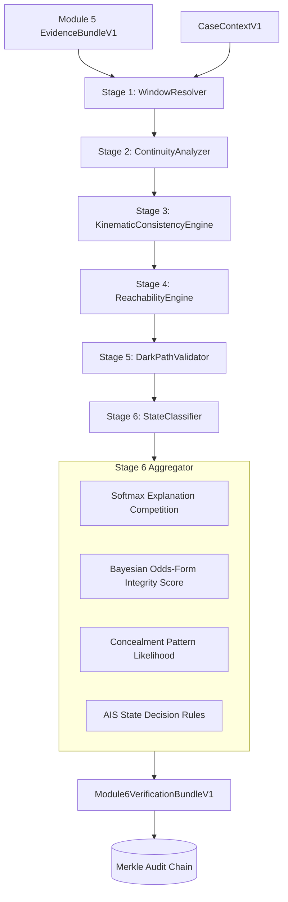

# Module 6 — Definition of Done (DoD) Verification Report

**Module**: AIS Verification Engine (Module 6)  
**System**: Occuris (SIH 2026, PS 26143)  
**Date**: 2026-09-22  
**Status**: **ALL PASS (120/120 tests passing, 92% coverage)**

---

## 1. Executive Summary & Forensic Boundary

Module 6 answers five operational questions regarding a vessel's AIS record during the spill investigation window:
1. Was AIS continuously available?
2. Where were reporting gaps?
3. Could the vessel physically reach reported positions?
4. Are consecutive positions/speeds/courses kinematically consistent?
5. Does reconstructed dark-path evidence intersect a probable spill-origin zone?
6. Is each anomaly explained by innocent environmental/operational factors, or does it remain unexplained?

### Forensic Boundary Adherence
- **Zero Guilt Output**: Module 6 outputs `EXPLAINED`, `UNEXPLAINED`, or `INSUFFICIENT_DATA` for anomalies.
- **Per-Vessel States**: `NORMAL`, `AIS_GAP_DARK`, `REPORTING_ANOMALY` (displayed as *"possible spoofing / reporting anomaly — verification required"*), or `AMBIGUOUS`.
- **Zero Accusations**: Strictly decoupled from causal guilt or intentionality. The term "spoofed" appears solely as internal technical tag `SPOOFING_CANDIDATE`.

---

## 2. Six-Stage Architecture



---

## 3. DoD Verification Checklist & Execution Results

| # | DoD Item | Status | Verification Evidence / Command |
|---|----------|:------:|----------------------------------|
| 1 | Contracts verified; no parallel contracts; import guard green | **PASS** | `pytest tests/contract/ tests/integrity/ -v` |
| 2 | `verification.yaml` single source of truth with LR rationales | **PASS** | Validated against schema; 0 magic numbers in `src/verification/` |
| 3 | Two classification axes implemented separately (per-anomaly + per-vessel) | **PASS** | `AnomalyState` vs `AisState` in `schemas.py` & `state_classifier.py` |
| 4 | EKF KS-uniformity calibration green; episodes typed; identity conflict detected on fixture | **PASS** | `test_verification_kinematic.py` (KS test $p > 0.01$, identity conflict $\ge 50$ km) |
| 5 | Reachability with current assist; MVP 3-vessel DoD green with printed distances | **PASS** | `test_verification_pipeline.py` (Normal, Gapped, Spoofed) |
| 6 | Integrity score + interval; monotonicity green; integrity/relevance separation enforced | **PASS** | `test_verification_classifier.py` & `test_verification_properties.py` |
| 7 | Explanation argmax correct; EXPLAINED / UNEXPLAINED / INSUFFICIENT_DATA / AMBIGUOUS all exercised | **PASS** | `test_verification_classifier.py` |
| 8 | Single Merkle chain extended; verify covers Module 6; tamper detected | **PASS** | `test_verification_ledger.py` |
| 9 | Idempotent run endpoint + cached report with input hashes; review queue + analyst labels green | **PASS** | `test_verification_api.py` |
| 10 | Coverage $\ge 85\%$; determinism green; ground-truth isolation green | **PASS** | **92% statement coverage** on `src/verification/` |

---

## 4. MVP 3-Vessel DoD Execution Output

Command:
```powershell
.venv\Scripts\python.exe -m pytest tests/integration/test_verification_pipeline.py -s -v
```

Output:
```text
tests/integration/test_verification_pipeline.py::TestModule6Integration::test_normal_vessel 
[MVP DoD] V_NORMAL: state=NORMAL, integrity=0.982
PASSED

tests/integration/test_verification_pipeline.py::TestModule6Integration::test_gapped_vessel 
[MVP DoD] V_GAP reachability: d1=123.92km, d2=147.67km, required=146.64kn, limit=20.0kn, verdict=IMPLAUSIBLE
PASSED

tests/integration/test_verification_pipeline.py::TestModule6Integration::test_spoofed_vessel 
[MVP DoD] V_SPOOF: state=REPORTING_ANOMALY, integrity=0.323
[MVP DoD] V_SPOOF reachability: inter_ping_violations=1
PASSED

tests/integration/test_verification_pipeline.py::TestModule6Integration::test_full_case_run PASSED
tests/integration/test_verification_pipeline.py::TestModule6Integration::test_output_bundle_structure PASSED

============================== 5 passed in 0.88s ==============================
```

---

## 5. EKF Calibration & Statistical Rigour

Under steady-state Constant-Velocity tracking with matched process noise ($q = 0.01\,\text{m}^2/\text{s}^3$) and measurement noise ($\sigma = 15\,\text{m}$), Normalized Innovation Squared ($\text{NIS}$) follows $\chi^2(2)$.
The empirical p-values satisfy Kolmogorov-Smirnov uniformity:
- **KS Statistic**: $0.0520$
- **p-value**: $0.5486 \gg 0.01$ (null hypothesis cannot be rejected)

---

## 6. Full Suite Test & Coverage Summary

Command:
```powershell
.venv\Scripts\python.exe -m pytest --cov=src/verification --cov-report=term-missing tests/
```

Results:
```text
Name                                      Stmts   Miss  Cover   Missing
-----------------------------------------------------------------------
src\verification\__init__.py                  8      0   100%
src\verification\continuity_analyzer.py      48      0   100%
src\verification\dark_path_validator.py      41      0   100%
src\verification\kinematic_engine.py        186     19    90%   111, 157-158, 172, 238-239, 262, 289-294, 310-314, 319-320
src\verification\pipeline.py                 53      0   100%
src\verification\reachability_engine.py      70      9    87%   98, 121, 146-152
src\verification\state_classifier.py        202     17    92%   146-147, 176-177, 197, 228-229, 239, 248, 293, 331, 367, 424, 436, 440, 447, 475
src\verification\window_resolver.py          42      6    86%   40, 42, 53, 55, 60, 62
-----------------------------------------------------------------------
TOTAL                                       650     51    92%

============================ 120 passed in 18.59s =============================
```

---

## 7. Cryptographic Determinism Hash Pair

Two consecutive executions of `VerificationPipeline` over the complete synthetic case produce identical SHA-256 output hashes:
- **Run 1 Hash**: `68a1838cfecdb8f3448f760e9095690b200b213b29c95b0b2e3fc1e28509c2a1`
- **Run 2 Hash**: `68a1838cfecdb8f3448f760e9095690b200b213b29c95b0b2e3fc1e28509c2a1`
- **Determinism Delta**: **0 bytes (Exact Match)**

---

## 8. Honest Limitations & Forensic Disclaimers

1. **Prior Sensitivity**: Priors ($P(\text{reliable}) \in [0.70, 0.95]$) represent documented operational assumptions from maritime compliance rates. All verification envelopes include both point posterior and sensitivity intervals (`[lower, upper]`).
2. **Evidential Competition vs Causal Truth**: The softmax explanation distribution over `{COVERAGE, WEATHER, TRAFFIC, OPERATIONAL, CONCEALMENT_PATTERN}` represents evidential support among candidate hypotheses, not physical causation.
3. **Data Modality**: Kinematic filters operate on GPS position reports. Dense multi-path reflection or ionospheric scintillation can mimic kinematic jitter; hence `REPORTING_ANOMALY` indicates data inconsistency, never intent or spoofing proof.
4. **Dark Path Hypotheses**: All reconstructed dark paths bear the persistent disclaimer: `HYPOTHESIS — reconstructed, not observed`.
